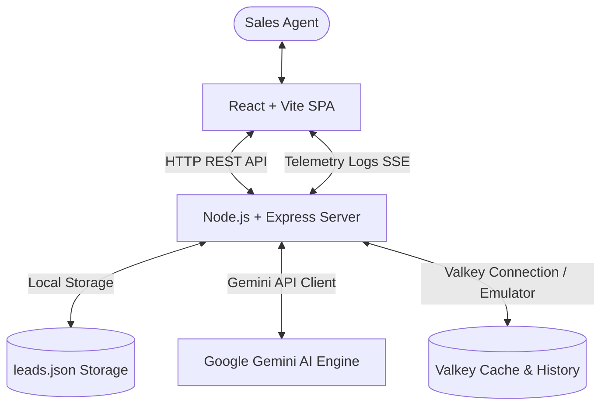

# AI Sales Copilot SaaS Application

An AI-powered sales enablement dashboard built to help sales teams prioritize B2B leads, generate tailored outbound outreach messages, and monitor pipeline metrics in real-time.

---

## 🏗️ System Architecture

The project is structured as a decoupled monorepo containing:
- **`backend/`**: Node.js + Express REST API, Gemini AI SDK integration, local database storage, and a Valkey caching layer with dynamic Server-Sent Events (SSE) telemetry.
- **`frontend/`**: React (Vite-scaffolded SPA) styled with Tailwind CSS, Lucide Icons, and Recharts, including a live-streaming developer CLI console.



---

## ⚡ Valkey Integration & CLI Telemetry

Valkey serves as the system's cache and session memory broker. 

### 1. Valkey Caching Strategies
- **AI Score Cache (`SETEX ai:score:<leadId> 3600 <value>`)**: Caches computed lead scoring metrics for 1 hour to prevent redundant AI model calls. Modifying any lead field automatically calls `DEL` on this key, invalidating the cache and ensuring data consistency.
- **AI Outreach Cache (`SETEX ai:followup:<leadId> 3600 <value>`)**: Caches email, LinkedIn, and WhatsApp follow-up templates.
- **Session Memory (`SET session:user` / `GET session:user`)**: Stores mock active user roles and active sessions.

### 2. Valkey Event Ledger (`LPUSH` / `LRANGE`)
- **Lead Audit Trails (`LPUSH history:lead:<leadId> <msg>`)**: Stores a transaction log of all actions performed on a lead (e.g. creation, score generation, cash fetches, field updates).

### 3. Graceful Connection Fallback (Emulator Mode)
If a Valkey server is not running on `localhost:6379`, the backend automatically launches a **Valkey Emulator** in memory. This tracks keys, lists, and expirations locally. The connection state is communicated to the client, displaying either **Valkey Connected** or **Emulated Fallback** on the UI.

---

## 🤖 Gemini AI Workflow

The copilot integrates with the **Google Gemini API** (`gemini-1.5-flash`) via the `@google/generative-ai` SDK.

### 1. Scoring Workflow
1. Lead is selected; user clicks **Analyze & Score**.
2. Express backend checks Valkey for cached results (`GET ai:score:<id>`).
3. On cache miss: The lead profile (name, company, industry, notes) is formatted into a structured context prompt.
4. Gemini evaluates the lead and returns a JSON response:
   ```json
   {
     "score": 88,
     "category": "Hot",
     "probability": 82,
     "reasoning": [
       "Prospect requested seat-based pricing details directly.",
       "Has direct decision-making power and budget control."
     ]
   }
   ```
5. Backend updates the lead database, caches the result in Valkey, appends a record in the Valkey history list, and sends the payload to the client.

### 2. Follow-up Generation Workflow
Uses the prospect's background and sales notes to generate tailored message templates for three distinct channels:
- **Email**: Subject line + formal, call-to-action oriented body.
- **LinkedIn**: Short connection note (<300 chars) focused on networking.
- **WhatsApp**: Casual, engaging message (<200 chars) using emojis.

---

## ⚙️ Setup & Installation

### Prerequisites
- **Node.js**: v18.0.0 or higher (v24.16.0 recommended)
- **Valkey/Redis** (Optional): Running on `localhost:6379`. If not present, the app will run in Emulator mode automatically.

### 1. Run the Backend
1. Open a terminal and navigate to the backend:
   ```bash
   cd backend
   ```
2. Install dependencies:
   ```bash
   npm install
   ```
3. Configure environment variables in `.env` (copy from `.env.example`):
   ```bash
   PORT=5000
   VALKEY_URL=redis://127.0.0.1:6379
   GEMINI_API_KEY=your_actual_gemini_api_key_here
   ```
   *Note: If no API key is supplied, the backend uses a simulated NLP rules engine to score leads and write templates, allowing full functionality check.*
4. Start the server:
   ```bash
   npm run dev
   ```
   The backend will listen on [http://localhost:5000](http://localhost:5000).

### 2. Run the Frontend
1. Open a new terminal and navigate to the frontend:
   ```bash
   cd frontend
   ```
2. Install dependencies:
   ```bash
   npm install
   ```
3. Start the Vite dev server:
   ```bash
   npm run dev
   ```
4. Access the dashboard at the printed address (usually [http://localhost:5173](http://localhost:5173)).

---

## 👤 Credentials & Initial Testing
- Log in to the dashboard using:
  - Email: `admin@copilot.ai`
  - Password: `password`
- Click **Reset Demo Leads** in the navigation bar to pre-populate the dashboard with 20 realistic leads spanning various verticals.
- Open the bottom **Valkey Live CLI Console** to watch commands stream in real-time as you navigate!
